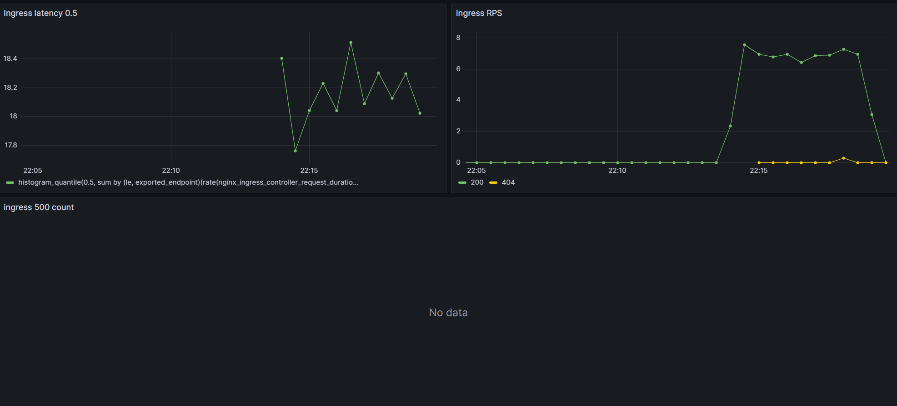
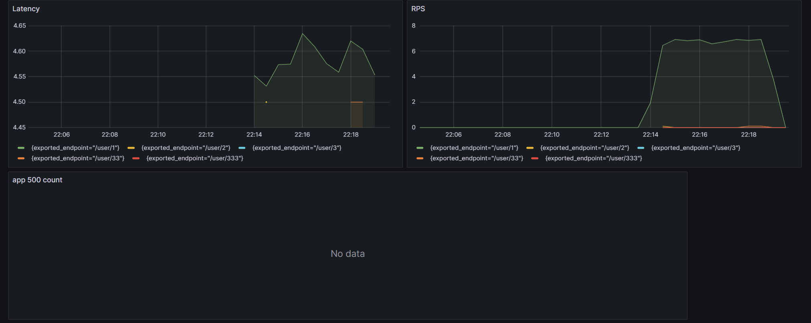

# hw3
установка ingress, prometheus и grafana 
````
kubectl create namespace monitoring

kubectl config set-context --current --namespace=monitoring

helm repo add prometheus-community https://prometheus-community.github.io/helm-charts

helm repo add stable https://charts.helm.sh/stable

helm repo add ingress-nginx https://kubernetes.github.io/ingress-nginx/

helm repo update

helm install nginx ingress-nginx/ingress-nginx --namespace monitoring -f ./monitoring/nginx-ingress.yaml
helm install prom prometheus-community/kube-prometheus-stack -f ./monitoring/prometheus.yaml --atomic
````

устанавливаем приложение в namespace default 
````
kubectl config set-context --current --namespace=default
helm install myapp ./crudapp-chart
````

импортируем дашборд в графану (CRUDAPP_DASHBOARD)
````
kubectl apply -f ./monitoring/grafana.yaml
````




