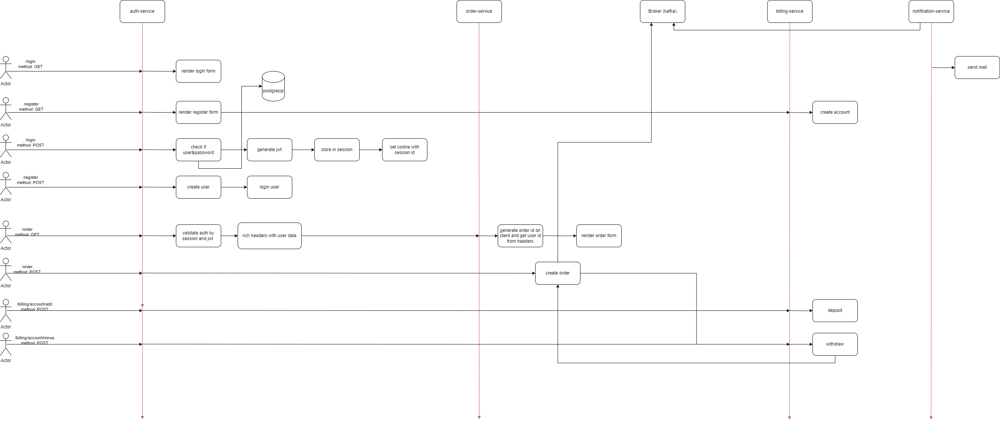

# hw7
# Интернет-магазин

Приложение позволяет заказывать товары в интернет магазине

## Сценарии

- Пользователь может зарегистрироваться в интернет-магазине
- Пользователь может авторизоваться в интернет-магазине
- Пользователь может пополнить баланс своего счёта
- Пользователь может получить баланс своего счёта
- Пользователь может создать заказ
- Пользователь получает уведомления о заказах

### Сущности

- Пользователь
- Заказ
- Уведомление
- Счёт

### Системные действия

- Регистрация
- Авторизация
- Пополнение счёта
- Получение баланса
- Создание заказа
- Получение уведомления

## Сервисы

- Сервис Авторизации
- Сервис Биллинга
- Сервис Заказов
- Сервис с

## Спецификация OpenAPI

[ABRAMOVKU-shop-1.0.0-swagger.yaml](ABRAMOVKU-shop-1.0.0-swagger.yaml)
## Схема сервисов

---
### Сервис Авторизации

Сервис предоставляет API для работы с пользователями: логин, регистрация, аутентификация и получение информации про пользователя

**Запросы**

- `GET /login` — форма логина
- `GET /logout` — разлогинить пользователя
- `POST /login` — логин пользователя
- `GET /register` — форма регистрации
- `POST /register` — регистрация пользователя
- `GET /register` — регистрация пользователя
- `GET /auth` — аутентификация
- `GET /user/([0-9]*)` — информация о пользователе
---
### Сервис Биллинга

Сервис предоставляет методы для работы со счетом пользователя: создание счета, пополнение и списание

**Запросы**

- `GET /billing/account/my` — отображает состояние счёта (баланса)
- `POST /billing/account` — создание счёта
- `POST /billing/account/add` — пополнение баланса счёта пользователя
- `POST /billing/account/minus` — списание денег со счёта пользователя

### Сервис Заказов

Сервис предоставляет методы для работы с заказами

**Запросы**

- `GET /order` — форма заказа
- `GET /order/list` — заказы пользователя
- `POST /order` — создание заказа

### Сервис Уведомлений

Сервис предоставляет методы для работы с уведомлениями

**Запросы**

- `GET /notifications` — отображает все уведомления пользователя

